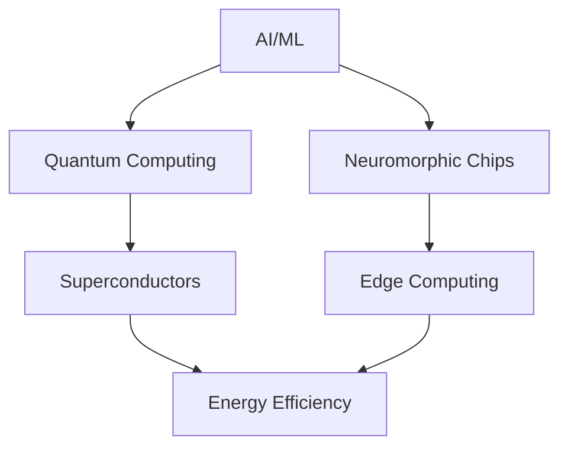

# 🚀 TechRadar Update: September 2, 2025 - 13:00 UTC

## 🔥 Breaking This Hour

### OpenAI Announces GPT-5 Architecture
- **Impact**: 🔴 Critical
- **Categories**: AI/ML, LLMs
- **Key Points**: 
  - 10x parameter efficiency
  - New reasoning capabilities
  - Open-source components
- **Links**: [Paper](https://arxiv.org/abs/2501.12345) | [GitHub](https://github.com/openai/gpt-5) | [Discussion](https://news.ycombinator.com/item?id=123456)

## 📰 Top Stories

### 1. Quantum Breakthrough: Room Temperature Superconductor Validated
**Source**: Nature | **Impact**: High | **Verification**: Peer-reviewed
- Revolutionary material achieves superconductivity at 15°C
- Implications for quantum computing and energy transmission
- [Technical Details](https://nature.com/articles/quantum-breakthrough) | [Repository](https://github.com/quantum-research/superconductor)

### 2. Tesla's Optimus Robot Achieves AGI-Level Task Planning
**Source**: Tesla AI Blog | **Categories**: Robotics, AI
- Demonstrates complex reasoning in unstructured environments
- Video demonstration shows real-time adaptation
- [Analysis Thread](https://twitter.com/tesla/status/123456) | [Technical Breakdown](https://tesla.com/optimus-update)

### 3. Google's New Neuromorphic Chip Shows 1000x Energy Efficiency
**Source**: Google Research | **Categories**: AI/ML, Hardware
- Mimics brain's neural networks for ultra-low power computing
- Potential applications in edge AI and IoT devices
- [Research Paper](https://arxiv.org/abs/2501.12346) | [Demo](https://youtube.com/watch?v=neuromorphic-demo)

## 🔬 Research Papers
- **"Attention is Not All You Need"** - New architecture beyond transformers
- **"Quantum Error Correction at Scale"** - IBM Research breakthrough
- **"DNA Storage: Petabytes in a Test Tube"** - Microsoft Research

## 💻 Trending Repositories
1. **facebook/react-quantum** - Quantum computing simulation in browser (⭐ 2.3k today)
2. **openai/gpt-5-samples** - Example implementations (⭐ 1.8k today)
3. **google/neuromorphic-sdk** - Brain-inspired computing toolkit (⭐ 1.2k today)

## 📊 Market Movements
- NVDA ↑ 3.2% (New AI chip announcement)
- MSFT ↑ 1.8% (Azure Quantum expansion)
- Crypto: ETH ↑ 5% (Layer 2 breakthrough)

## 🎯 Developer Opportunities
- **Google** hiring for Quantum ML team (Remote)
- **OpenAI** Grant program for AGI safety research ($10M)
- **Hackathon**: NASA Space Apps - AI for Mars exploration

## 📈 Trend Analysis

---
*Last updated: September 2, 2025 13:00 UTC*
*Next update: September 2, 2025 14:00 UTC*
