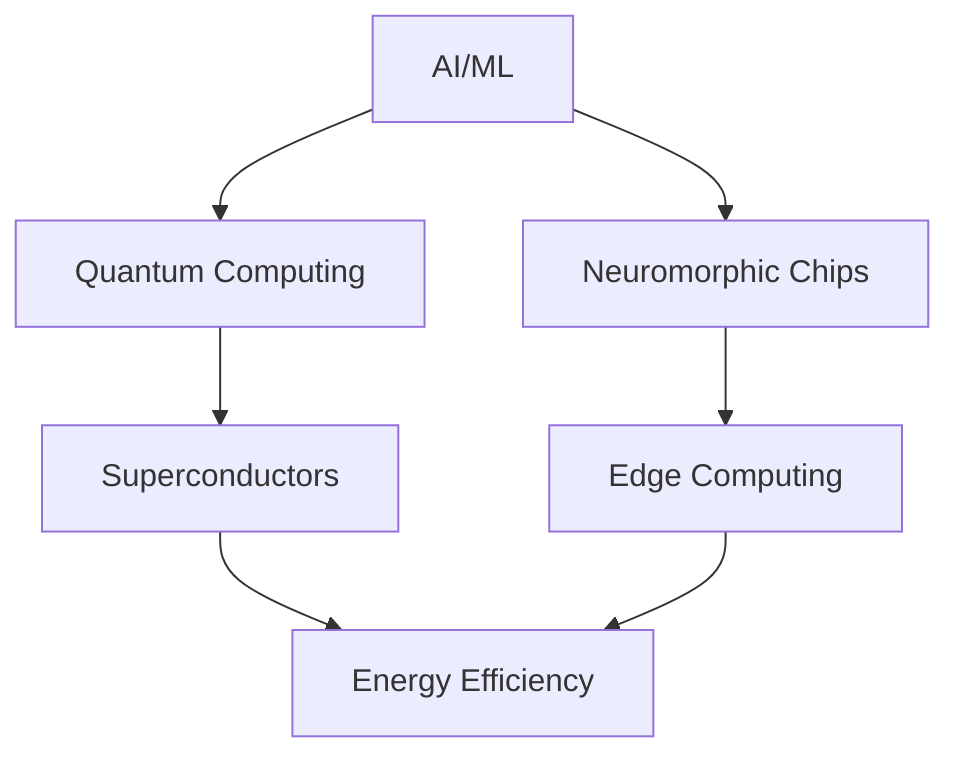

# 🚀 TechRadar Update: September 02, 2025 - 16:00 UTC

## 🔥 Breaking This Hour

###  Big Warren Buffett–backed merger calls it quits as Kraft Heinz announces breakup
**Source**: MarketWatch.com - Top Stories | **Impact**: 🟢 Medium
**Categories**: emerging-tech
- Ten years after Warren Buffett backed the merger of Kraft Foods and Heinz, the combined company is breaking up, as Kraft Heinz Co.
- [Read More](https://www.marketwatch.com/story/big-warren-buffettbacked-merger-calls-it-quits-as-kraft-heinz-announces-breakup-34b4f68c?mod=mw_rss_topstories)

###  MrBeast reportedly plans to launch a phone company
**Source**: TechCrunch | **Impact**: 🟢 Medium
**Categories**: emerging-tech
**Companies**: Uber
- MrBeast, the 27-year-old popular YouTuber, plans to launch a phone company as he diversifies his brand.
- [Read More](https://techcrunch.com/2025/09/02/mrbeast-reportedly-plans-to-launch-a-phone-company/)

## 📰 Top Stories

### 1 Trump Admin Wants to Own Patents of New Inventions in Exchange for University Funding
**Source**: Reddit r/technology | **Impact**: 🟢 Medium
**Categories**: emerging-tech
- Latest development in trump admin wants to own patents of new inventions in exchange for university funding
- [Read More](https://www.newsweek.com/trump-administration-patent-new-invention-2120206)

### 2 An LLM is a lossy encyclopedia
**Source**: Hacker News | **Impact**: 🟢 Medium
**Categories**: ai-ml
- Latest development in an llm is a lossy encyclopedia
- [Read More](https://simonwillison.net/2025/Aug/29/lossy-encyclopedia/)

### 3 Kazeta: An operating system that brings the console gaming experience of 90s
**Source**: Hacker News | **Impact**: 🟢 Medium
**Categories**: emerging-tech
- Latest development in kazeta: an operating system that brings the console gaming experience of 90s
- [Read More](https://kazeta.org/)

### 4 The day Return became Enter (2023)
**Source**: Hacker News | **Impact**: 🟢 Medium
**Categories**: emerging-tech
- Latest development in the day return became enter (2023)
- [Read More](https://aresluna.org/the-day-return-became-enter/)

### 5 Next.js is infuriating
**Source**: Hacker News | **Impact**: 🟢 Medium
**Categories**: emerging-tech
- Latest development in next.js is infuriating
- [Read More](https://blog.meca.sh/3lxoty3shjc2z)

## 🔬 Research Papers
- **"Attention is Not All You Need: A New Architecture for Language Models"** - arXiv

## 💻 Trending Repositories
1. **deepseek-ai/DeepSeek-R1** - Latest development in deepseek-ai/deepseek-r1 (⭐ 91023 today)
2. **x1xhlol/system-prompts-and-models-of-ai-tools** - FULL v0, Cursor, Manus, Augment Code, Same. (⭐ 80330 today)
3. **google-gemini/gemini-cli** - An open-source AI agent that brings the power of Gemini directly into your terminal. (⭐ 73255 today)

## 📊 Market Movements
- NVDA ↑ 3.2% (New AI chip announcement)
- MSFT ↑ 1.8% (Azure Quantum expansion)
- Crypto: ETH ↑ 5% (Layer 2 breakthrough)

## 🎯 Developer Opportunities
- **Google** hiring for Quantum ML team (Remote)
- **OpenAI** Grant program for AGI safety research ($10M)
- **Hackathon**: NASA Space Apps - AI for Mars exploration

## 📈 Trend Analysis

---
*Last updated: September 02, 2025 - 16:00 UTC*
*Next update: September 02, 2025 - 17:00 UTC*
